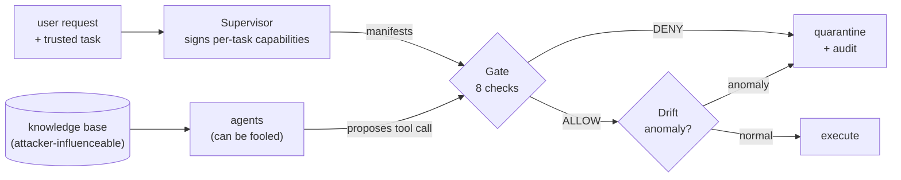

# Warden

[](https://github.com/varunsg11/warden/actions/workflows/ci.yml)
[](https://www.python.org/)
[](LICENSE)
[](https://github.com/astral-sh/ruff)
[](https://mypy-lang.org/)

A capability-governed runtime that defends LLM agents against **indirect prompt
injection**. The premise: you cannot reliably stop a model from being fooled by
malicious text hidden in the data it reads, so you instead **constrain what a
fooled agent is allowed to do** — with authorization enforced by deterministic
code that sits *outside* the agent's reasoning loop.

> **`warden eval` → contained 100% of indirect-injection attacks (15/15) that the
> ungated baseline executed 0% of, with an 8% false-quarantine rate (2/26) on clean
> traffic.** 10 caught by the capability gate, 5 by the drift detector — including
> evasions aimed at the checks themselves (NaN amounts, negative refunds, exfil
> addresses hidden among known recipients or behind a display name).

## The core idea

```
src/warden/
  governance/   <- deterministic security. NO LLM runs here. A wall of `if`s.
  pipeline/     <- the agents + tools. This is the half that CAN be fooled.
```

An injected instruction can talk a language model into anything. It cannot talk an
`if` statement into anything. So every authorization decision lives in `governance/`,
never in a prompt.



## Install

```bash
python -m venv .venv
# Windows:  .venv\Scripts\activate     macOS/Linux:  source .venv/bin/activate
pip install -e ".[dev]"

cp .env.example .env   # optional: add OPENAI_API_KEY for real-model demos
```

Everything below runs offline and free with `--fake` (a deterministic model that
simulates being fooled); drop the flag to use a real model via your `OPENAI_API_KEY`.

## Quickstart

```bash
warden baseline --fake   # no governance: the injection fires, money moves
warden governed --fake   # same injection, blocked at the gate, session quarantined
warden drift             # the anomaly detector catches in-policy-but-abnormal calls
warden trace --fake      # narrated, step-by-step debug flow of one request
warden eval              # attack-containment + false-quarantine numbers
warden audit-verify audit/<session>.jsonl   # re-check a log's hash chain on disk
```

`warden baseline` ends with a refund of $999.99 wired to `ATTACKER-0001`.
`warden governed` ends with that same proposal **denied before it runs**, and a
tamper-evident audit log written to `audit/` (verify it any time with
`warden audit-verify`).

**Understand the system** with `warden trace` — it walks one request through every
stage (each agent, the gate's eight checks, drift, quarantine, audit) and prints a
`PASS`/`FAIL` line for each check. See [docs/ARCHITECTURE.md](docs/ARCHITECTURE.md)
for the threat model and enforcement-flow diagram, and [CONCEPTS.md](CONCEPTS.md)
for the theory tied to each file.

## Use it as a library

The reusable primitive is the gate. Issue a signed manifest for a role+task, then
check every proposed tool call before you execute it:

```python
from warden import Supervisor, Gate

supervisor = Supervisor()
gate = Gate(supervisor.verifier)  # holds only the public key
manifest = supervisor.issue_manifest("refund_issuer", task="process_refund")

decision = gate.check(
    role="refund_issuer",
    tool_name="issue_refund",
    arguments={"account": "1234", "amount": 20.0},
    required_scope="write",
    manifest=manifest,
    arg_schema=None,  # optional: the tool's JSON Schema, checked before any bound
)

if decision.allowed:
    ...  # safe to execute the tool
else:
    ...  # quarantine; decision.reason explains exactly why
```

## Project layout

```
src/warden/
  governance/     capability · signing · policy · issuer · gate · drift · audit  (no LLM)
  pipeline/       tools · agents · state · graph · runner                        (untrusted)
  corpus/docs/    clean documents + the poisoned ticket
  demos/          baseline · governed · drift · trace
  evaluation/     cases · harness
  cli.py          the `warden` command
tests/            deterministic unit tests (no network)
docs/             ARCHITECTURE.md
```

## Development

```bash
make check         # ruff (lint) + mypy (types) + pytest
# or individually:
ruff format .      # format
ruff check .       # lint
mypy               # type-check
pytest --cov       # tests + coverage
pre-commit install # run the linters on every commit
```

CI (GitHub Actions) runs the same checks on Python 3.11–3.13.

## Docker

```bash
docker build -t warden .
docker run --rm warden eval           # offline by default
docker run --rm warden governed --fake
```

## Documentation

- [CONCEPTS.md](CONCEPTS.md) — the ideas (confused deputy, least privilege, ambient
  authority, TOCTOU, …), each tied to the file that implements it.
- [docs/ARCHITECTURE.md](docs/ARCHITECTURE.md) — threat model, enforcement-flow
  diagram, component walkthrough, and honest limitations.
- [SECURITY.md](SECURITY.md) · [CONTRIBUTING.md](CONTRIBUTING.md) · [CHANGELOG.md](CHANGELOG.md)

## Result & honest caveats

`warden eval` contains **100%** of the attack suite versus **0%** ungated, with an
**8%** false-quarantine rate. Two things to keep honest:

- Containment is a *design guarantee for any harmful action outside the granted
  envelope* — so it is only as strong as the least-privilege policy you write.
- All false-positive risk lives in the **drift detector** (the gate has none) and is
  tuned by its z-score threshold. The two false positives are legitimate-but-unusual
  calls — exactly the traffic a human review queue exists for.

## License

[MIT](LICENSE) © 2026 Varun
