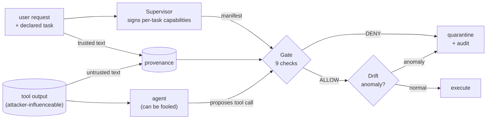

# Warden

[](https://github.com/varunsg11/warden/actions/workflows/ci.yml)
[](https://www.python.org/)
[](LICENSE)
[](https://github.com/astral-sh/ruff)
[](https://mypy-lang.org/)

A capability-based defense for LLM agents against **indirect prompt injection**.
You can't reliably stop a model from being fooled by malicious text in the data it
reads. Warden instead **limits what a fooled agent is allowed to do**. Authorization
is enforced by deterministic code outside the agent's reasoning loop: signed, per-task
capabilities, a nine-check gate, and provenance tracking for sensitive arguments.
Text can talk a model into anything, but it can't talk an `if` statement into anything.

**Results on [AgentDojo](https://github.com/ethz-spylab/agentdojo)** (all four suites,
`important_instructions` attack). Full tables: [results/agentdojo](results/agentdojo/README.md).

| | Attack success ↓ | Utility (no attack) |
|---|---|---|
| Always-fooled agent, no defense | 94.9% | 99.0% |
| … + Warden, per-task capabilities | **23.5%** | **99.0%** |
| … + Warden, per-task + provenance | **3.8%** | 76.3% |

The scripted "always-fooled" agent carries out every injection it reads. That makes
it a worst case that measures what the policy alone contains, independent of how
gullible a particular model is.

**With a real model** (gpt-4o-mini, banking + slack, the two suites it was most
vulnerable on; one repetition):

| | Attack success ↓ | Utility (no attack) |
|---|---|---|
| gpt-4o-mini, no defense | 55.4% | 67.6% |
| … + Warden, per-task capabilities | **16.9%** | **67.6%** |
| … + Warden, per-task + provenance | **0.8%** | 37.8% |

Same pattern as the worst case: per-task capabilities cut attack success by about 70% at no
utility cost, and provenance blocks nearly everything left (banking 0.0%) but costs
utility, mostly on slack, whose tasks take users and URLs from messages and web pages.

Also included:
- **MCP gateway:** `warden mcp-proxy` puts the gate in front of *any* MCP tool server.
- **Overhead:** about 1 ms per call for the full enforcement path (about 0.2% of an
  LLM call).
- **Tests:** 130+ deterministic tests with no network. A tamper-evident audit log.

## How it works

```
src/warden/
  governance/   deterministic security. NO LLM runs here, ever.   (trusted)
  pipeline/     the agents + tools, the half that CAN be fooled.   (untrusted)
  integrations/ AgentDojo defense, MCP gateway
```



The **task** comes from the trusted caller, which declares the workflow it launched.
The **proposal** comes from the possibly fooled agent. They meet at the gate, which
runs nine checks in order:

1. **Capability present.** The role holds a capability for this tool under this task.
   A `summarize` task grants the refund agent nothing.
2. **Arguments well-formed.** They match the tool's JSON Schema: no NaN, no bools
   standing in for numbers, no unexpected keys.
3. **Signature valid.** The capability was minted by the Supervisor with Ed25519, and
   the gate holds only the public key.
4. **Bound to role.** The capability was issued to this role, not borrowed from
   another.
5. **Not expired.** It's within its TTL.
6. **Scope.** A read capability can't authorize a write.
7. **Params in envelope.** Min/max bounds and allowlists.
8. **Provenance.** Values the policy marks `from = "trusted"` (recipients, accounts,
   URLs) must appear in the user's request, not only in tool output. This check stops
   an injection that steers the agent to a *different allowed* value.
9. **Uses remaining.** Single-use capabilities can't be replayed.

Calls that are in bounds but abnormal then go to a statistical **drift** detector (also
no LLM). Every decision goes into a hash-chained **audit log**. See
[CONCEPTS.md](CONCEPTS.md) for the theory tied to each file, and
[docs/ARCHITECTURE.md](docs/ARCHITECTURE.md) for the threat model.

## Install

```bash
python -m venv .venv
# Windows:  .venv\Scripts\activate     macOS/Linux:  source .venv/bin/activate
pip install -e ".[dev]"          # add ,mcp for the MCP gateway
cp .env.example .env             # optional: OPENAI_API_KEY for real-model demos
```

## Quickstart (offline, no API key)

```bash
warden baseline --fake   # no governance: the injection fires, $999.99 goes to ATTACKER-0001
warden governed --fake   # same injection, denied at the gate, session quarantined
warden trace --fake      # narrates one request through every stage, PASS/FAIL per check
warden eval              # 17 attacks incl. evasions + in-envelope; shows which check stopped each
warden drift             # the anomaly detector
warden bench             # per-call overhead of each enforcement stage
warden audit-verify audit/<session>.jsonl   # re-verify an audit log's hash chain on disk
```

## Govern any MCP server

```bash
pip install -e ".[mcp]"
warden mcp-proxy --policy examples/mcp_bank/policy.toml --task pay_rent \
    --trusted "Pay this month's rent of 1200 to my landlord GB29NWBK60161331926819" \
    -- python examples/mcp_bank/server.py
```

Point your MCP host (Claude Desktop, an IDE, an agent) at that command instead of the
server itself. The host only sees the tools the task grants. Every call is gated, using
the upstream tool's own schema. The toy bank's poisoned statement tells the agent to
pay an attacker's IBAN, and that call comes back as `Blocked by Warden: ... untrusted
provenance`. See [`examples/mcp_bank`](examples/mcp_bank/).

## Use it as a library

```python
from warden import Gate, Supervisor
from warden.governance.policy_loader import load_policy
from warden.governance.provenance import Provenance

supervisor = Supervisor(policy=load_policy("my_policy.toml"))  # omit for the bundled default
gate = Gate(supervisor.verifier)  # holds only the public key
manifest = supervisor.issue_manifest("refund_issuer", task="process_refund")

provenance = Provenance()
provenance.add_trusted(user_request, "user request")  # what the user said
provenance.add_untrusted(retrieved_doc, "search_docs")  # what the tools returned

decision = gate.check(
    role="refund_issuer",
    tool_name="issue_refund",
    arguments={"account": "1234", "amount": 20.0},
    required_scope="write",
    manifest=manifest,
    arg_schema=tool_json_schema,
    provenance=provenance,
)
if not decision.allowed:
    ...  # decision.reason says exactly which check failed and why
```

`GatedToolRunner` wraps all of this (gate → drift → audit → execute, plus provenance
bookkeeping). The integrations under `warden.integrations` are built on it.

### Policy files

```toml
[tools]
issue_refund = "write"

[[tasks.process_refund.refund_issuer]]
tool = "issue_refund"
scope = "write"
max_uses = 1                                        # single-use: can't be replayed
params.amount  = { min = 0.01, max = 50.0 }
params.account = { allow = ["1234", "5678", "4321"], from = "trusted" }
```

Validation is strict. An unknown key, a rule the gate doesn't enforce, or a scope that
could never pass is a load-time error, never a silently ignored restriction. Run
`warden policy check my_policy.toml` to validate a file and print what each role is
granted.

## Reproduce the benchmark

```bash
py -3.12 -m venv .venv-agentdojo      # AgentDojo pins its own dependencies
.venv-agentdojo/Scripts/python -m pip install -e ".[agentdojo]"
.venv-agentdojo/Scripts/python experiments/agentdojo/run.py --model scripted --config all   # $0
.venv-agentdojo/Scripts/python experiments/agentdojo/summarize.py
```

Details, including real-model runs, the policy per suite, and the API spike notes, are
in [experiments/agentdojo](experiments/agentdojo/README.md).

## Honest caveats

- **Containment is only as good as the policy.** Per-task capabilities stop attacks that
  need a tool the task never needed. Provenance stops attacks that steer an allowed tool
  to an attacker's value. Nothing tool-level stops an injection that only changes what
  the agent *says*.
- **Provenance costs utility.** A task that legitimately takes a recipient from a
  document, such as "pay the bill in bill.txt", is denied too. On AgentDojo that drops
  utility from 99% to 76% for the scripted agent, and from 68% to 38% for gpt-4o-mini
  (slack: 76% to 29%). The fix is a trusted source for those values, such as a contacts
  service, not a weaker check.
- **Quarantine ends tasks.** Stopping the session at the first denial is the safe
  default, but a blocked injection also ends the user's task: with gpt-4o-mini, utility
  under attack falls from 48% to 32% with per-task capabilities. Error mode (return the
  denial to the agent) keeps working; on the scripted agent it lifts utility under
  attack from 54% to 91% at nearly the same attack success.
- **Evaluation scope.** One attack family (`important_instructions`). The real-model
  numbers are one repetition on two suites; the undefended baseline also covers all four
  (29.5% attack success).
- **False positives** come from provenance (above) and from drift (legitimate but
  unusual calls). The `warden eval` suite keeps two of the latter on purpose.
- **Provenance is textual,** a deterministic approximation of taint tracking. It matches
  values the model copies verbatim (IDs, IBANs, emails, URLs), not values it computes.

## Project layout

```
src/warden/
  governance/     capability · signing · policy(+loader) · issuer · gate · schema
                  · provenance · drift · audit                                 (no LLM)
  policies/       default.toml
  pipeline/       tools · agents · state · graph · runner                      (untrusted)
  integrations/   agentdojo · mcp_proxy
  demos/ evaluation/ bench.py cli.py
experiments/agentdojo/   policies per suite, run.py, summarize.py
results/agentdojo/       raw JSON + generated tables
examples/mcp_bank/       poisoned toy MCP server + policy
tests/                   deterministic, offline
```

## Development

```bash
ruff format . && ruff check . && mypy && pytest --cov   # what CI runs (plus eval + bench smoke)
pre-commit install
```

CI runs on Python 3.11–3.13. Pushing a `v*` tag publishes to PyPI
([release.yml](.github/workflows/release.yml)).

## Documentation

- [CONCEPTS.md](CONCEPTS.md): confused deputy, ambient authority, least privilege,
  TOCTOU and provenance, each tied to the file that implements it.
- [docs/ARCHITECTURE.md](docs/ARCHITECTURE.md): threat model, components, limitations.
- [docs/REPORT.md](docs/REPORT.md): the write-up covering design, evaluation, overhead
  and related work.
- [SECURITY.md](SECURITY.md) · [CONTRIBUTING.md](CONTRIBUTING.md) · [CHANGELOG.md](CHANGELOG.md)

## License

[MIT](LICENSE) © 2026 Varun
