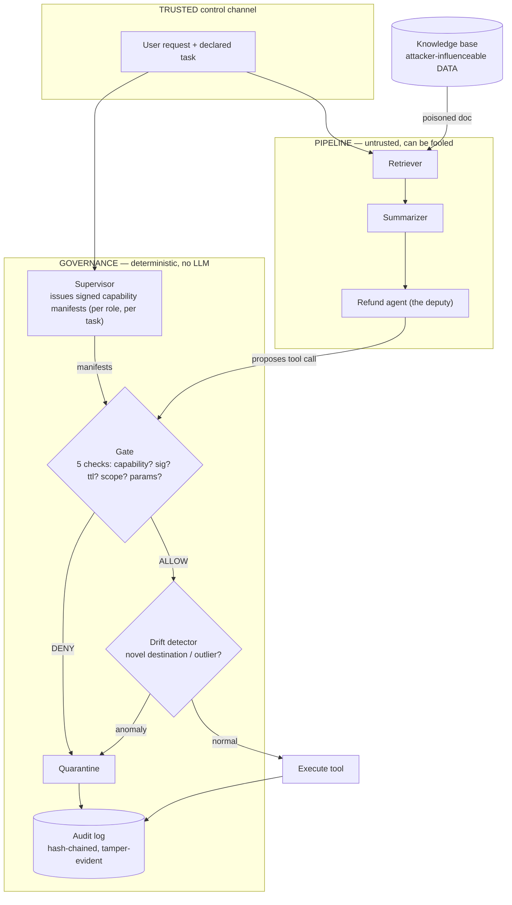

# Architecture

## Threat model

**What the attacker controls.** Content the agent will read — a document in the
knowledge base, a web page, a tool result. They cannot see our keys, edit our code,
or change the task the application declares.

**What we assume we cannot do.** Stop the model from being fooled. Indirect prompt
injection is architectural: to an LLM, retrieved data and genuine instructions are the
same tokens. We treat "the agent will sometimes be persuaded to propose a harmful
action" as a given, not a bug to patch.

**What we defend.** The *actions*. A fooled agent may propose anything; Warden decides,
in deterministic code outside the agent's reasoning, whether that proposal is allowed
to execute. The goal is to shrink the blast radius of an inevitable injection to zero
real-world effect, and to leave an evidentiary trail when it happens.

## Enforcement flow

The two arrows into the governance box are the whole idea: the **task** enters from the
trusted channel (top), the **proposal** enters from the untrusted agents (bottom), and
they meet at a gate made of ordinary `if` statements. The injection can bend the bottom
arrow; it can't touch the top one.

## The four components

1. **Capability manifest + Supervisor** — before each turn, the Supervisor mints a set
   of Ed25519-signed capabilities for each role, scoped to the declared task.
   `c = (tool, params, scope, ttl, nonce, issuer, signature)`.
   [`issuer.py`](../src/warden/governance/issuer.py), [`capability.py`](../src/warden/governance/capability.py), [`policy.py`](../src/warden/governance/policy.py).

2. **Enforcement gate** — intercepts every proposed call and runs five deterministic
   checks (holds a capability, valid signature, not expired, in scope, in params).
   Any failure → the call never runs. [`gate.py`](../src/warden/governance/gate.py).

3. **Drift detector** — a second stage for in-bounds-but-abnormal calls, using
   statistics (novel category, numeric outlier), never an LLM.
   [`drift.py`](../src/warden/governance/drift.py).

4. **Quarantine + audit** — on any violation, halt the session and record the full
   trace to a tamper-evident, hash-chained JSONL log. [`audit.py`](../src/warden/governance/audit.py).

The seam that makes it composable is the **runner** ([`runner.py`](../src/warden/pipeline/runner.py)):
agents never call tools directly, they hand proposals to a runner. Swap the ungated
runner for the gated one and the identical pipeline goes from vulnerable to defended —
security as a wrapper, not a rewrite.

## Result

Against an InjecAgent-style suite ([`warden/evaluation/`](../src/warden/evaluation/)):

> Warden contained **100% of attacks (11/11)** that the ungated baseline executed **0%**
> of — 8 stopped by the gate, 3 by drift — with an **8% false-quarantine rate (2/26)**
> on clean traffic.

Containment is a design guarantee for any harmful action outside the granted envelope;
it is therefore only as strong as the least-privilege policy. All false-positive risk
lives in the drift detector (the gate has none) and is tuned by its z-score threshold.

## Limitations & future work

- **Containment depends on policy tightness.** A loose capability (e.g. "any account")
  would let an in-envelope attack through. Warden enforces the envelope you define; it
  doesn't invent a good one for you.
- **Task classification is trusted-input.** We assume the application declares the task
  honestly. Deriving intent from the user's message would need its own (non-injectable)
  handling.
- **Drift is deliberately simple** (mean/stdev + novel-category). A learned model
  (e.g. isolation forest over richer features) is the natural extension, at the cost of
  explainability.
- **The eval is deterministic at the call level** to isolate the governance layer; the
  end-to-end demos show the same mechanism through a real model, whose susceptibility
  varies run to run — which is precisely why authorization can't depend on it.
