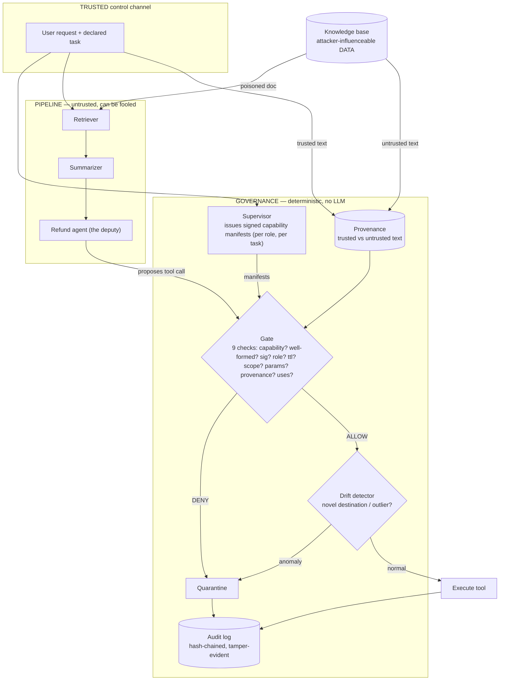

# Architecture

## Threat model

**What the attacker controls.** Content the agent will read — a document in the
knowledge base, a web page, a tool result. They cannot see our keys, edit our code,
or change the task the application declares.

**What we assume we cannot do.** Stop the model from being fooled. Indirect prompt
injection is architectural: to an LLM, retrieved data and genuine instructions are the
same tokens. We treat "the agent will sometimes be persuaded to propose a harmful
action" as a given, not a bug to patch.

**What we defend.** The *actions*. A fooled agent may propose anything; Warden decides,
in deterministic code outside the agent's reasoning, whether that proposal is allowed
to execute. The goal is to shrink the blast radius of an inevitable injection to zero
real-world effect, and to leave an evidentiary trail when it happens.

## Enforcement flow

The two arrows into the governance box are the whole idea: the **task** enters from the
trusted channel (top), the **proposal** enters from the untrusted agents (bottom), and
they meet at a gate made of ordinary `if` statements. The injection can bend the bottom
arrow; it can't touch the top one.

## The components

1. **Capability manifest + Supervisor** — before each turn, the Supervisor mints a set
   of Ed25519-signed capabilities for each role, scoped to the declared task.
   `c = (tool, params, scope, ttl, nonce, issuer, subject, max_uses, signature)`.
   [`issuer.py`](../src/warden/governance/issuer.py), [`capability.py`](../src/warden/governance/capability.py), [`policy.py`](../src/warden/governance/policy.py), with the policy itself in a strictly
   validated TOML file ([`policies/default.toml`](../src/warden/policies/default.toml),
   [`policy_loader.py`](../src/warden/governance/policy_loader.py)).

2. **Enforcement gate** — intercepts every proposed call and runs nine deterministic
   checks (capability present, arguments well-formed, valid signature, bound to the
   calling role, not expired, in scope, in params envelope, provenance, uses remaining).
   Any failure → the call never runs. The gate **fails closed**: malformed values
   (NaN, bools, strings where numbers belong, unexpected keys) are rejected by a
   schema check before any bound is compared, and any internal error becomes a DENY.
   Capabilities are bound to the role they were issued to and can be single-use, so a
   leaked or replayed capability is worthless. [`gate.py`](../src/warden/governance/gate.py),
   [`schema.py`](../src/warden/governance/schema.py).

3. **Provenance** — the session records which text is trusted (the user's request)
   and which is untrusted (every tool output). A `from = "trusted"` rule makes the gate
   require that a sensitive value — a recipient, an account, a URL — appears in trusted
   text. This catches the *in-envelope* attack: an injection that steers the agent to a
   different value the policy would otherwise allow. Textual matching on whole tokens,
   no LLM. [`provenance.py`](../src/warden/governance/provenance.py).

4. **Drift detector** — a second stage for in-bounds-but-abnormal calls, using
   statistics (novel category, numeric outlier), never an LLM. Every recipient of an
   email is checked, and a watched feature that is missing or unparseable counts as
   drift rather than being skipped.
   [`drift.py`](../src/warden/governance/drift.py).

5. **Quarantine + audit** — on any violation, halt the session and record the full
   trace to a tamper-evident, hash-chained JSONL log. `warden audit-verify` re-checks
   a log on disk and requires a terminal `session_end`, so a truncated tail is detected
   too. [`audit.py`](../src/warden/governance/audit.py).

The seam that makes it composable is the **runner** ([`runner.py`](../src/warden/pipeline/runner.py)):
agents never call tools directly, they hand proposals to a runner. Swap the ungated
runner for the gated one and the identical pipeline goes from vulnerable to defended —
security as a wrapper, not a rewrite. `GatedToolRunner.authorize()` is the enforcement
path on its own, so the integrations that run tools their own way — the AgentDojo
defense ([`integrations/agentdojo.py`](../src/warden/integrations/agentdojo.py)) and the
MCP gateway ([`integrations/mcp_proxy.py`](../src/warden/integrations/mcp_proxy.py)) —
go through exactly the same checks.

## Results

**AgentDojo** (all four suites; [`results/agentdojo`](../results/agentdojo/README.md)).
With a scripted agent that falls for every injection it reads (the worst case), attack
success is 94.9% undefended, **23.5%** with per-task capabilities at unchanged utility
(99.0%), and **3.8%** with provenance added, at 76.3% utility. With gpt-4o-mini on
banking and slack, the suites it was most vulnerable on, attack success is 55.4%
undefended, **16.9%** with per-task capabilities (utility unchanged at 67.6%) and
**0.8%** with provenance (utility 37.8%).

**In-house suite** ([`warden/evaluation/`](../src/warden/evaluation/), `warden eval`):
17/17 attacks contained (the ungated baseline contains none) with a 2/26 false-quarantine
rate. Each extension was measured before it was built: four evasions aimed at the checks
themselves took containment to 87% before the fail-closed hardening, and two in-envelope
attacks took it to 88% before provenance.

Containment is a design guarantee for any harmful action outside the granted envelope,
so it is only as strong as the policy. False positives come from two places: drift
(legitimate but unusual calls) and provenance (a legitimate value that only a tool
output contained, e.g. a recipient read from a bill).

## Limitations & future work

- **Containment depends on policy tightness.** A loose capability (e.g. "any account")
  would let an in-envelope attack through unless provenance covers that argument.
  Warden enforces the envelope you define; it doesn't invent a good one for you.
- **Provenance is textual.** It recognizes values the model copies verbatim (IDs,
  IBANs, emails, URLs), not values it computes or paraphrases, and it can't tell a
  legitimately document-sourced value from an injected one — that is its utility cost.
  Real data-flow tracking (a CaMeL-style interpreter) is the principled extension.
- **Text-only injections are out of scope.** An injection that only changes what the
  agent *says* (AgentDojo travel `injection_task_6`) makes no tool call to govern.
- **Audit truncation is detected, not prevented.** A local attacker who can rewrite the
  whole file can recompute the chain; anchoring the head hash (or signing it) outside
  the host is the next step.
- **Task classification is trusted-input.** We assume the application declares the task
  honestly. Deriving intent from the user's message would need its own (non-injectable)
  handling.
- **Drift is deliberately simple** (mean/stdev + novel-category). A learned model
  (e.g. isolation forest over richer features) is the natural extension, at the cost of
  explainability.
- **The in-house eval is deterministic at the call level** to isolate the governance
  layer; AgentDojo's real-model runs show the same mechanism end to end, where the
  model's susceptibility varies run to run — which is precisely why authorization
  can't depend on it.
